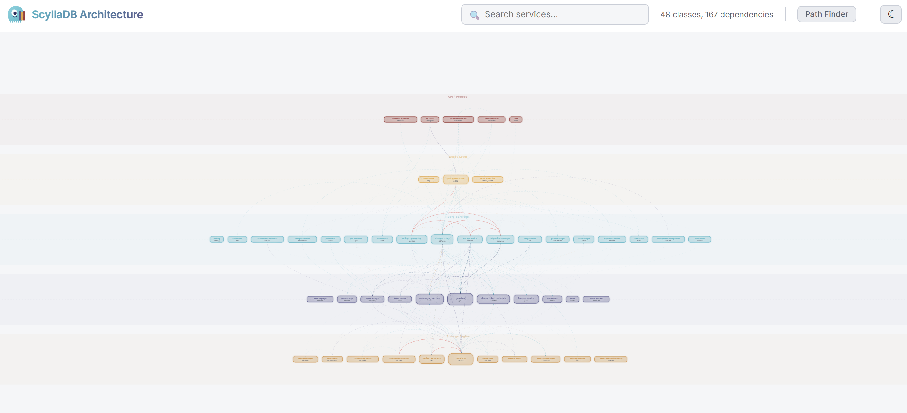

# scylla-archviz

**ScyllaDB Architecture Dependency Visualizer** — an interactive dependency graph of ScyllaDB's C++ sharded service classes.

## What is this?

A single-file D3.js app that maps out **48 classes** and **167 dependencies** discovered from the actual ScyllaDB C++ source code. Each dependency edge includes the type of reference (sharded-ref, raw-ptr, pluggable, etc.), usage strength, and a description of what it's used for — all verified against the real codebase.

## Features

- **Layered graph** — services organized into 5 tiers: Storage, Cluster, Services, Query, API
- **Click a node** — left panel shows all incoming/outgoing dependencies with type badges
- **Hover a dependency** — right panel shows how the dependency is actually used in the source code, and the target node blinks on the graph
- **Path Finder** — click two nodes to find the shortest dependency path between them
- **Search** — filter services by name
- **Zero dependencies** — single `index.html` file, just open it in a browser

## Data accuracy

All dependency edges were analyzed from the [ScyllaDB source](https://github.com/scylladb/scylladb) — checking `.hh` member fields and `.cc` usage patterns. Edges that turned out to be indirect or nonexistent were removed. Each description explains the functional purpose of the dependency, not just what type it holds.

## License

MIT
